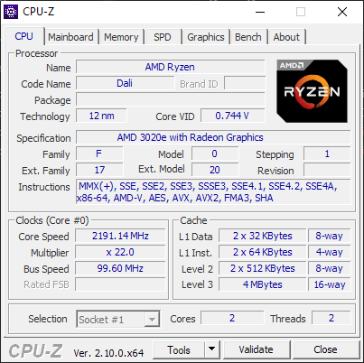
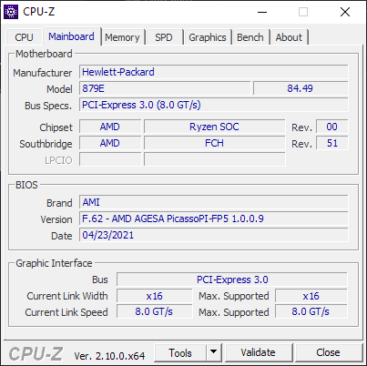
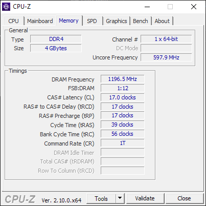
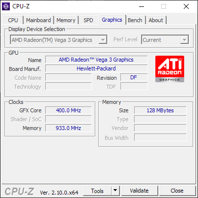

# My Windows Setup (As of March 09, 2025)

## Windows Version
I'm using Windows 10 Pro 22H2

## Shell
I love PowerShell, but it's a bit slow on my machine so I use `cmd` most of the times.

## Editor
I use Sublime Text as my primary text editor to edit both source files and other text files.
It's great and I would recommend it to anyone regardless of their computer skills.

## Applications
Here are some other applications I use:
- GitHub Desktop - To manage my git repositories
- Firefox - Web browser
- Audacity - Audio editor
- Free Download Manager - To download large files
- Paint.NET - Basic image editing
- Visual Studio 2022 - For WinForms and Win32/C++
- SumatraPDF - For quick PDF viewing
- ShareX - To record quick screencasts in GIF or MP4 formats.

Here are also some games I play:
- osu!(lazer)
- AssaultCube 1.3.0.2
- Modern Combat 5

# Device Specifications
I'm using an HP 245 G8
The specifications of this device are as follows:
- CPU

- Mainboard

- Memory

- Graphics

> PS: Links will be added later

That's all for now! I'll update this document if I have anything else to share. Cheers :)

### [*Go to next post (Setup Mar 09, 2025)*](setup-09-03-2025.md)